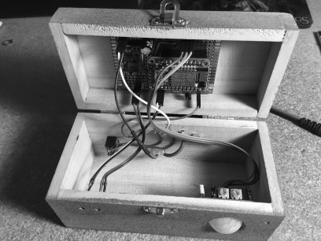

# ESP8266_PIR_Alarm
Motion Burglar Alarm using ESP8266 HUZZAH, PIR sensor and SMS messaging via IFTTT

### Overview
EEEOOO EEEOOO EEEOOO! You just triggered my motion detection burglar alarm system. But don’t worry, here’s how to build your own alarm.
I used the Adafruit HUZZAH ESP8266 as it has good tutorials for initially getting it set up. I also used the Arduino IDE with the ESP8266 library, since I was already quite familiar with using it with the Huzzah ESP8266. A PIR sensor is used to detect motion.  

It sounds an external 12v Alarm horn or loud buzzer as well as sends an SMS message to your phone via IFTTT  (www.ifttt.com). 

#### See: [ESP8266_PIR_Alarm.pdf](ESP8266_PIR_Alarm.pdf) for details!
